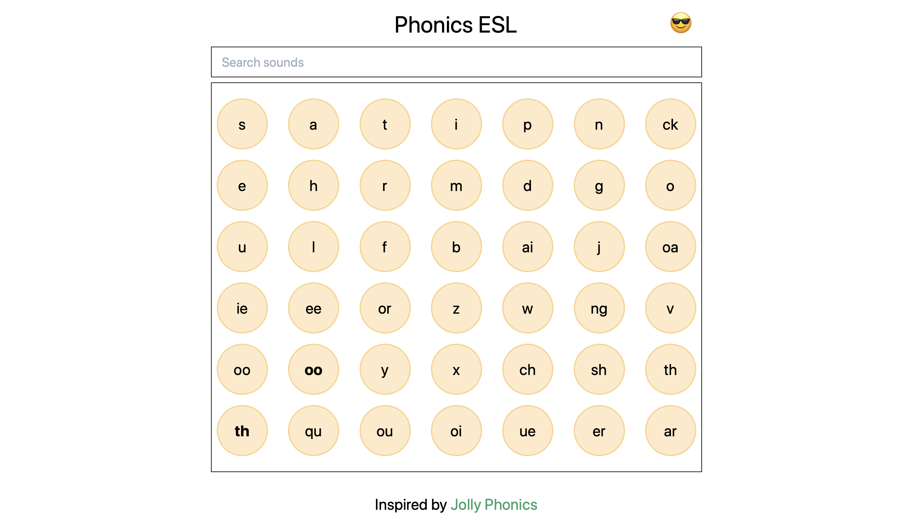

# Phonics ESL

A simple tool to review English Phonics based on [Jolly Phonics](http://jollyreading.com/introduction-to-jolly-phonics/).

This project was built in order to explore [TailwindCSS](https://tailwindcss.com/).

This project was bootstrapped with [Create React App](https://github.com/facebook/create-react-app).

## Features

- [x] React Hooks (useState, useEffect, useRef)
- [x] Functional Components
- [x] Search Functionality
- [x] Simple Modal System
- [x] Light / Dark Theme (saved in localStorage)
- [x] Mobile First Design

## Screenshots

### Mobile

### Desktop

## Development

- Did you notice a bug? Please report it [here](https://github.com/yougotwill/phonics-esl/issues/new?labels=bug&template=bug_report.md)
- Want to request a feature? Please let me know [here](https://github.com/yougotwill/motii/issues/new?labels=enhancement&template=feature_request.md')

## References

- [React + Tailwind Setup](https://medium.com/quick-code/tailwind-react-typescript-a0317155e5ee)
- [Hover tooltips](https://github.com/Cosbgn/tailwindcss-tooltips/blob/master/README.md)
- [CSS Triangle for tooltip](https://dev.to/adriantwarog/learn-how-to-make-a-triangle-in-css-once-and-for-all-2pfe)
- [Referencing HTML audio element](https://reactjs.org/docs/hooks-reference.html#useref)
- [Jolly Phonics Sounds](https://www.jollylearning.co.uk/resource-bank/learn-the-letter-sounds/)
- [Jolly Phonics Gestures](https://www.jollylearning.co.uk/resource-bank/jolly-phonics-actions/)
- [Modal with tailwindcss](https://codeburst.io/creating-a-modal-dialog-with-tailwind-css-42722c9aea4f)
- [Modal closing behaviour](https://stackoverflow.com/questions/37573608/how-to-make-modal-close-on-click-outside/37573735)
